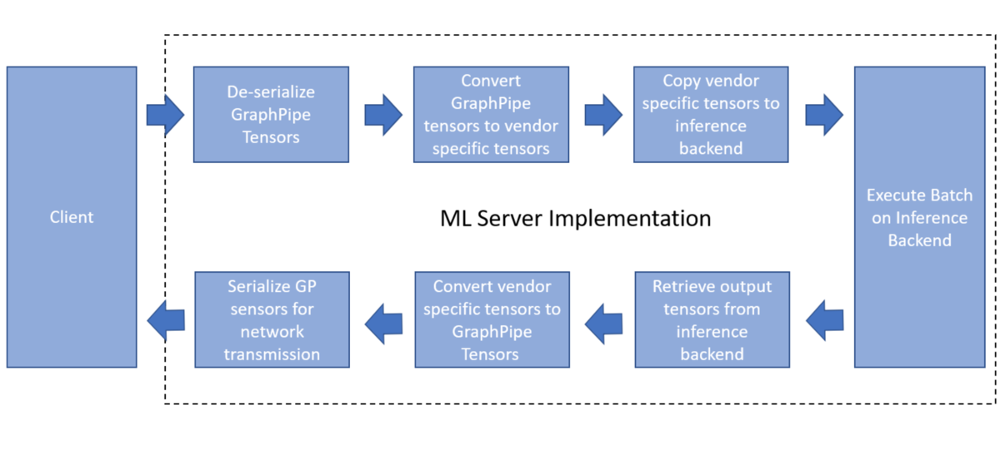

# Serving Models with GraphPipe

In addition to an efficient protocol, GraphPipe offers reference model servers
written in go to simplify the process of deploying machine learning models.  In
our experience, converting existing models into a common format can involve
lots of pitfalls. We therefore provide model servers that can natively run the
most common ML model formats.

The servers can be found in the cmd subdirectory of the
[graphpipe-go](https://github.com/oracle/graphpipe-go)
repository:

* [`graphpipe-tf`](https://github.com/oracle/graphpipe-go/tree/master/cmd/graphpipe-tf)
  uses libtensorflow to serve tensorflow models.
* [`graphpipe-onnx`](https://github.com/oracle/graphpipe-go/tree/master/cmd/graphpipe-onnx)
  uses libcaffe2 to serve caffe2 and onnx models.

## Goals

In designing the model servers we aimed to achieve the following:

* Excellent performance
* Simple, documented build process
* Flexible code that is easy to work with
* Support for the most common ML Frameworks
* Optimized cpu and gpu support

## Overview of server functionality
The basic mechanics of what our reference servers do is fairly straightforward.

In order to minimize overhead, we have attempted to make the the illustrated
steps as efficient as possible.  For example, because we use flatbuffers as a
network transport format, de-serialization is effectively a pointer cast.

## Language Choice

While go isn't a common language in the ML space, it is ideal for creating
efficient servers. It is also an explicit and friendly language without many
surprises, which makes it an excellent language for collaboration.  These
qualities make it an ideal choice for GraphPipe's model servers.

The one drawback of go is that because existing ML Frameworks are written
in C/C++, there is a slight overhead when context switching from go code into
the framework backend. In practice, however, we have seen very little
real-world performance impact due to this.  During performance testing, our go
code achieved virtually the same performance as an optimized build of
tensorflow-serving, which is written in pure C++.

## CUDA GPU Acceleration
For each of our reference servers, we provide docker images and source code for
building binaries optimized to run with CUDA acceleration.

## MKL CPU acceleration
In order to provide maximize compatibility between our various server builds, and
also to maximize performance, the CPU builds of our servers are compiled with
[MKL](https://software.intel.com/en-us/mkl).  When using Tensorflow, MKL
provides the added benefit of supporting channels_first image ordering for
convolutional operations, which is generally the preferred ordering when using GPU.
Thus, when using the default configurations of GraphPipe servers, CPU and GPU
versions can serve the same models and accept the same inputs.

Of course, it could be that your specific use requires different optimizations
or channel ordering; if this is the case, it should be straightforward to tweak
the source code to build a custom version for your needs.

## Caching

One of the advantages of a language like go is easy access to simple and
powerful libraries. We were therefore able to add some shared code to create a
row-level cache for both of the model servers.  This optional row-level cache
is based on [boltdb](https://github.com/coreos/bbolt) and can be very useful
for models that receive many requests for the same data. The cache can often
return data in a matter of microseconds, whereas a large model can take
hundreds of milliseconds to process a request.
